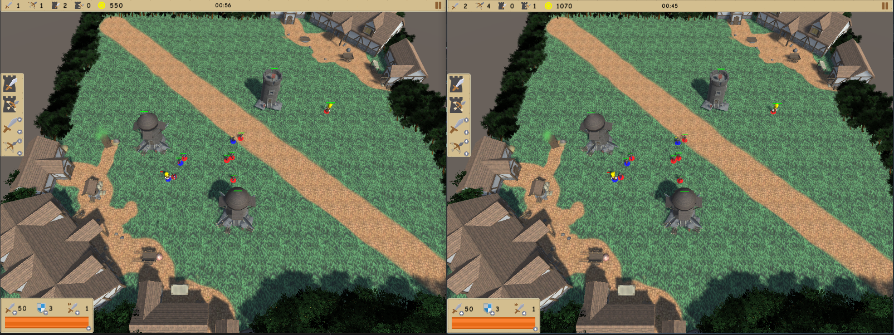

# HeroTowerDefense
competitive tower defense game

## YouTube

## Built With
* [Unity](https://unity.com/) - real-time 3D development platform

## Assets
* [Medieval Toon Character](https://assetstore.unity.com/packages/3d/characters/medieval-toon-character-19641)
* [Medieval Sword](https://assetstore.unity.com/packages/3d/medieval-sword-73359)
* [Goblin Ranger](https://assetstore.unity.com/packages/3d/characters/humanoids/goblin-ranger-14607)
* [Medieval Town Exteriors](https://assetstore.unity.com/packages/3d/environments/fantasy/medieval-town-exteriors-27026)
* [Medieval Stone Keep](https://assetstore.unity.com/packages/3d/environments/medieval-stone-keep-56596)
* [Nature Starter Kit 1](https://assetstore.unity.com/packages/3d/environments/nature-starter-kit-1-49962)
* [shield icon](http://iconshow.me/)
* [UI Icon](https://kenney.nl/assets?q=ui)
* [RPG Audio](https://kenney.nl/assets/rpg-audio)
* [Swords Collide Sound](https://soundcloud.com/kevin-wong-86/swords-collide-sound-explorer)
* [Arrow Sound Effects](https://www.freesoundeffects.com/)
* [World Flavours](https://www.playonloop.com/?s=World+Flavours&post_type=product)
* [Comic Neue](http://www.comicneue.com/)

## Author
 * [Ultimatonium(me)](@Ultimatonium)
 * [Lexikus](https://github.com/Lexikus)
 * [Ronny]
